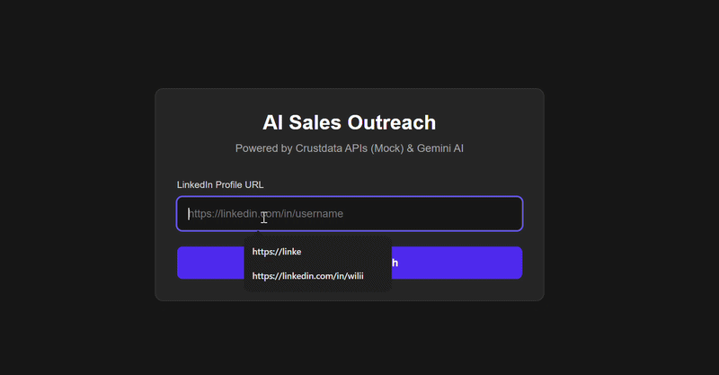

# Crustdata Demo: AI Sales Outreach Tool

This is a mock demo showcasing how Crustdata APIs could power an AI sales outreach application.



## Purpose
The tool aims to generate tailored outreach messages for prospective clients by enriching basic LinkedIn profiles with detailed professional data and recent social posts.

## Production Endpoints
In a production environment, this application would use actual [Crustdata APIs](https://crustdata.com/) rather than mock data:

1. **People Enrichment API**: We would send the user's LinkedIn URL to this API to obtain accurate, up-to-date professional details including `name` and `title`.
2. **Social Posts API**: We would use this endpoint to fetch the recent LinkedIn activity for the specific person to incorporate into the context window for our AI prompt.

*Currently, this app generates the message using these hypothetical endpoints replaced by mock JSON instances.

## Setup Instructions

1. **Install Dependencies**
   ```bash
   npm install
   ```

2. **Environment variables**
   Create a `.env.local` file at the root of the project with your Gemini API Key:
  

3. **Run the Development Server**
   ```bash
   npm run dev
   ```

4. Open [http://localhost:3000](http://localhost:3000) with your browser to see the result.
